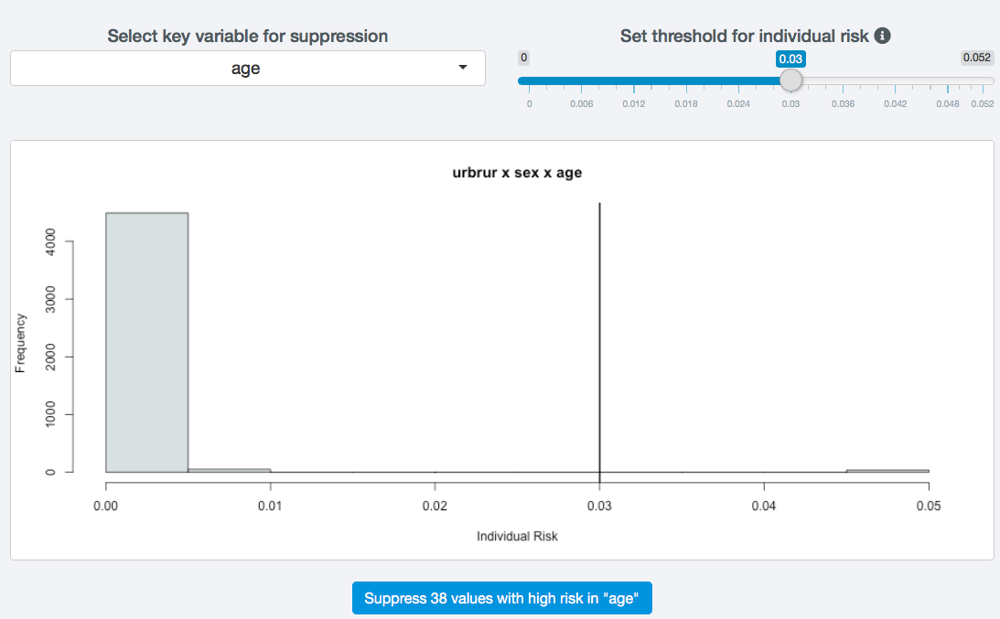

Anonymization methods
======================

Once the disclosure risk is evaluated and is too high for release, SDC methods need
to be applied to the variables to reduce the risk. This process is a iterative, i.e.,
after applying a certain method with a set of parameters, the disclosure risk 
needs to be reassessed and the information loss needs to be evaluated. If the result is not
satisfactory, other methods can be applied to other variables. It is also possible to 
undo the method and reapply the same method with a different  set of parameters.

In this section, we provide a brief description of common SDC methods for microdata and
show how to use these in *sdcApp*. For more information on the choice of the 
appropriate method and more detailed information on the methods themselves, we refer to ...

Recoding
--------

Global recoding
~~~~~~~~~~~~~~~
Global recoding combines several categories of a categorical variable or constructs
intervals for continuous variables. This reduces the number of categories available 
in the data and potentially the disclosure risk, especially for categories with few 
observations, but also, importantly, it reduces the level of detail of information 
available to the analyst. 

Variable needs to be of type factor and key variable

Variables can already be recoded before on data tab

.. _fig81:

.. figure:: media/anonGlobalRecodeSettings.png
   :align: center
   
   Settings for global recoding to recode the variable age

Top and bottom coding
~~~~~~~~~~~~~~~~~~~~~
Top and bottom coding are similar to global recoding, but instead of recoding all values, 
only the top and/or bottom values of the distribution or categories are recoded. This can 
be applied only to ordinal categorical variables and (semi-)continuous variables, since 
the values have to be at least ordered. Top and bottom coding is especially useful if 
the bulk of the values lies in the center of the distribution with the peripheral 
categories having only few observations (outliers). Examples are age and income; for 
these variables, there will often be only a few observations above certain thresholds, 
typically at the tails of the distribution. The fewer the observations within a category, 
the higher the identification risk. One solution could be grouping the values at the tails 
of the distribution into one category. This reduces the risk for those observations, and, 
importantly, does so without reducing the data utility for the other observations in the
distribution.

.. _fig82:

   
   Settings for topcoding the variable income at 8 million

.. NOTE::
	Top and bottom coding ca only be applied to numeric variables. If age, as in our example,
	is converted to factor, the global recoding method needs to be used, in order to
	topcode age by grouping all values above the threshold.

.. NOTE::
	IT is advised to use a replacement value different than the threshold value,
	such as the weighted mean or median to reduce information loss. The replacement
	value needs to be computed in a different software and manually inserted in *sdcApp*. 

k-Anonimity / local suppression
--------------------------------
It is common in surveys to encounter values for certain variables or combinations
of quasi-identifiers (keys) that are shared by very few individuals. When this occurs, 
the risk of re-identification for those respondents is higher than the rest of the 
respondents (see the Section k-anonymity). Often local suppression is used after 
reducing the number of keys in the data by recoding the appropriate variables. 
Recoding reduces the number of necessary suppressions as well as the computation 
time needed for suppression. Suppression of values means that values of a variable 
are replaced by a missing value (NA in R). The the Section k-anonymity discusses how 
missing values influence frequency counts and k-anonymity. 

.. _fig83:

   
   Settings for local suppression to achieve 3-anonimity
   
Importance
~~~~~~~~~~
.. _fig84:

   
   Importance settings for local suppression

Subsets
~~~~~~~
.. _fig85:

   
   Subset settings for local suppression

~~~~~~~~~~~~~~~

PRAM
----
.. _fig86:

   
   Settings for PRAM
   

.. _fig87:

   
   Settings for PRAM with customized transition matrix

Suppress values with high risk
------------------------------
.. _fig88:

   
   Settings for suppressing values in records with high risk

Top/Bottom coding
-----------------

Microaggregation
----------------
.. _fig89:

.. figure:: media/anonMicroaggregationSettingsCluster.png
   :align: center
   
   Settings for microaggregation

.. _fig810:

   
   Additional settings for microaggregation

.. _fig811:

.. figure:: media/anonMicroaggregationSettingsCluster.png
   :align: center
   
   Cluster settings for microaggregation

Adding noise
------------

Rank swapping
-------------

Undo
----
Finding an anonymization strategy for a microdata dataset is a trial-and-error process. 
The effect on risk and utility of different methods with different parameter settings can
only be assessed by executing the methods on the actual dataset. Therefore, it is unlikely
to find a satisfactory anonymization strategy at the first attempt. Before another method
is applied, the previous method needs to be canceled. In *sdcApp* it is possible
to undo the last method applied with one click. To test the effect of a combination
of several methods, which is recommended, it is necessary to cancel several steps.
To do so, the state of the SDC problem before applying the methods is saved to disk and can
be reloaded afterwards. This is the same as canceling several steps. Both methods are
described below.

Undo one step
~~~~~~~~~~~~~
In order to undo one step, 

risk measures etc are also reset, script not, random seed not

Undo several steps
~~~~~~~~~~~~~~~~~~
Recommended to 

Save and reload
