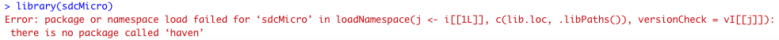

Installation and updating
=========================

This section will guide you through the steps you need to take to install *sdcApp*.
*sdcApp* is a graphical user interface (GUI) for the sdcMicro package.
The *sdcMicro* package is an add-on package for the statistical software *R*. In order
to start working with *sdcApp*, you need to install *R*, *RStudio* [1]_ as well as several
add-on packages for R. All software is available free of charge and open-source.
*R* and *RStudio* run on most operating systems (OS), including Windows, Mac OS X and Linux. To use *sdcApp*,
a webbrowser needs to be installed as well [2]_.

*R*, *RStudio*, the *sdcMicro* package as well as dependencies (other *R* packages
that need to be installed for the *sdcMicro* package to work properly) are regularly updated.
Therefore, it is recommended to regularly update to the latest version of the software.
The Section `Updating R, RStudio and the sdcMicro package`_ shows how to check for updates
and install updates.

Installing R and RStudio
-------------------------
The first step in the installation of *sdcApp* is the installation of *R* and *RStudio*. The
free open source statistical software R can be downloaded from the `CRAN website <https://cran.r-project.org>`_.
By selecting your OS (cf. :numref:`fig21`), the installer will be dowloaded to your computer. In order to install
*R*, open the installer and follow the installation steps.

.. _fig21:

.. figure:: media/installDownloadR.png
   :align: center

   Select OS to start downloading R

Once *R* is successfully installed, you can install *RStudio*. *RStudio* is an IDE
(integrated development environment) for *R*.
*RStudio* makes working with *R* much easier. *RStudio Desktop* and *RStudio Server* can be downloaded
free of charge from the `RStudio <https://www.rstudio.com/products/rstudio/download/>`_ website.
On this webpage, you can click on the blue button under '2: Install RStudio' as shown in :numref:`fig22`
or scroll down to the overview of different versions
and select the version corresponding to your OS to start downloading the installer.
In order to install *RStudio*, open the installer and follow the installation steps.

.. _fig22:

   Click on the blue button under 2: Install RStudio

.. NOTE::
	We recommend updating to the latest versions of *R* and *RStudio* if this software is already
	installed on your computer before moving on.
	See also the Sections `Updating R`_ and `Updating RStudio`_ for more information on updating the software.

Once *R* and *RStudio* are installed on your computer, open *RStudio*. The *RStudio* interface consists
by default of four different panes as shown in :numref:`fig23`.

1.	Script editor (by default left up)
2. 	Workspace and history (by default right up)
3. 	R console (by default left down)
4.	Plots, files and help (by default right down)

.. _fig23:

   Screenshot RStudio

Installing sdcMicro package
---------------------------
*sdcApp* is included in the *R* package *sdcMicro*. Once *RStudio* is opened, *sdcMicro* can be
installed by executing commands in the *R* console. *sdcMicro* and a set of other *R* packages
that are required by the *sdcMicro* package are downloaded from the CRAN servers. Therefore,
it is necessary to be connected to the internet during the installation process. [3]_

In order to install the latest version of the *sdcMicro* package, type the command
:code:`install.packages("sdcMicro", dependencies = TRUE)` in the console and press enter to execute (cf. :numref:`fig24`).
The first time you are installing *R* packages, you will be prompted
to select a CRAN mirror (server) to install the package from.
Since the packages on all mirrors are identical, you can choose any of the locations.
The *sdcMicro* package itself uses functionality
from a set of other *R* packages (e.g., *haven* for reading files in different formats).
By specifying the dependencies argument to TRUE, these dependencies will automatically be installed too.

.. code-block:: R
   :linenos:
   :caption: Installing sdcMicro package
   :name: code01

   # install sdcMicro package
   install.packages("sdcMicro", dependencies = TRUE)

.. _fig24:

   Installing sdcMicro package from *R* console

.. NOTE::
	Also dependencies will be installed and the installation may take some time.
	Dependencies are other add-on packages, of which the functionality is required to run the *sdcMicro* package.

Launching *sdcApp*
-------------------

Once the *sdcMicro* package is successfully installed, the *sdcMicro* package needs to be loaded.
Installing the package is only required once (except for updating), whereas loading the
package is required every time a new *R* session is started.

You can load the *sdcMicro* package by typing :code:`library(sdcMicro)`
and launch the application by typing :code:`sdcApp()` (cf. :numref:`fig25`).

.. code-block:: R
   :linenos:
   :caption: Loading sdcMicro package and launching *sdcApp*
   :name: code02

   # Load sdcMicro package
   library(sdcMicro)

   # Launch sdcApp (opens in browser window)
   sdcApp()

*sdcApp* opens in your system's default web browser through the local host IP :code:`127.0.0.1:` (cf. :numref:`fig26`).
*sdcApp* works with recent versions of any webbrowser.
Due to small issues encountered with some browsers, we recommend to use Google Chrome,
Mozilla Firefox or Safari for the best performance.
In case your default web browser is not one of the aforementioned browsers, you can simply open an
alternative browser and copy paste the local host IP address from the *R* console
into the new browser.
*sdcApp* will open in the new browser.

.. NOTE::
	An internet connection is not required while using *sdcMicro* and *sdcApp* and the data
	are stored locally on your computer or server. The web browser uses a local host IP,
	which is not connected to the internet and the browser is only used to communicate with
	the running *R* session.

.. NOTE::
	After launching *sdcApp* the *R* session is busy and cannot be used for other calculations.

Furthermore, it's important that your *R* session is enabled to use the installed webbrowser.

.. _fig25:

   *R* console with local IP after launching *sdcApp*

.. _fig26:

   Start screen sdcApp in browser with local IP

In rare cases, not all dependencies are correctly installed and the following error
message appears in the *R* console upon loading the sdcMicro package (cf. :numref:`fig27`).
In that case, install the package(s) indicated in the error message manually by using the
command :code:`install.packages()` with the name of the package(s). In the example error message,
this would be for the *haven* package.

.. _fig27:

   Error message in console in case of missing dependencies

Updating R, RStudio and the sdcMicro package
---------------------------------------------
*R*, *RStudio*, the *sdcMicro* package as well as dependencies are regularly updated. Updates include
bug fixes as well as additional functionality. Therefore,
it is recommended to regularly update to the latest version of the software.

Updating R
~~~~~~~~~~
*RStudio* uses by default the most recent version of *R* available on your system. New
versions of *R* packages, including the *sdcMicro* package, rely on the newest version of *R*. Therefore,
it's important to regularly check for updates of *R*. The easiest way to do so
is to visit regularly the `CRAN website <https://cran.r-project.org>`_.
If a new version of *R* is available, the same steps as for the installation of *R* need to be followed
as described in the Section `Installing R and RStudio`_. The version number of the
*R* version installed on your computer appears in the R console upon launching *R* or *RStudio*
(cf. :numref:`fig28`).

.. _fig28:

   R console with version number

Updating RStudio
~~~~~~~~~~~~~~~~
To check for updates in *RStudio*, go to Help -> Check for updates. If an update is available,
the current version number and the newest version number are shown. In order to install
the newer version, you need to visit the
`RStudio <https://www.rstudio.com/products/rstudio/download/>`_ website and follow the steps
as described in the Section `Installing R and RStudio`_.

Updating R packages
~~~~~~~~~~~~~~~~~~~
The *sdcMicro* package is regularly updated to fix bugs and add functionality. In order to check
for newer versions, click on the Update button to get an overview of all packages that have
newer versions available (cf. :numref:`fig29`). By clicking **Select all**,
these packages are all automatically updated.

.. NOTE:::
	For checking for newer versions and updating, the computer must be connected to the internet.

.. _fig29:

   Updating *R* packages in RStudio

Alternatively, one can type the command :code:`update.packages()` in the *R* console to
update all installed packages.

.. code-block:: R
   :linenos:
   :caption: Updating packages
   :name: code03

   # Update packages
   update.packages()

Bug reporting on GitHub
-----------------------

The sdcMicro package is open source software and the source code can be easily viewed on
the `GitHub <https://github.com/sdcTools/sdcMicro>`_ of the *sdcMicro* project. There you can
also report alleged bugs and raise other issues.

.. [1] Technically speaking, *RStudio* is not required to run *sdcApp*. Nevertheless, we recommend to install *RStudio* for a better user experience.
.. [2] *sdcApp* is a *Shiny* web application, which works best in a recent version of a webbrowser. Therefore, it is recommended to ensure that your webbrowser is updated regularly. Some webbrowsers may impede the proper functioning of *sdcApp*. If *sdcApp* doesn't work properly in your default web browser, please try to install Firefox or Google Chrome.
.. [3] It is possible to download *R*, *RStudio* and the packages and transfer the files to the computer with for example a USB drive in case the computer
	   *sdcMicro* should be installed on cannot be connected to the internet for technical or confidentiality reasons.
