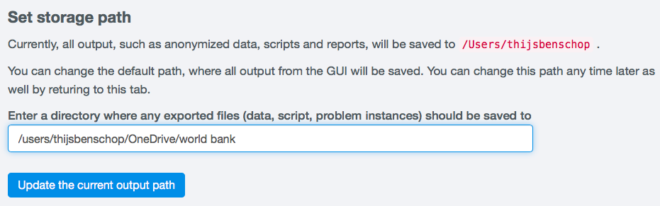

Introduction to sdcApp
=======================

*sdcApp* is a user-friendly application for microdata anonymization
and is built on the `Shiny <https://shiny.rstudio.com>`_
technology. *Shiny* allows users to
communicate through a GUI that runs in a webbrowser with a local *R* session. The local
*R* session performs the necessary calculations. In the case of *sdcApp*, most functionality
used in *R* is included in the `sdcMicro <https://CRAN.R-project.org/package=sdcMicro>`_
package.

*sdcApp* has a tab structure and consists of seven tabs, which in turn consist of
up to three panels. This structured is further explored below.
The tabs and panels are used to navigate through the app.

Starting sdcApp
-----------------
After successful installation (see the Section `Installation and updating <installation.html>`__),
*sdcApp* is ready for use. Every single time *sdcApp* is used,
first the applications *R* or *RStudio* need to be opened. We recommend to use *RStudio*
for ease of use. After launching *R* or *RStudio*,
the *sdcMicro* package needs to be loaded and *sdcApp* needs to be launched.
To load *sdcMicro* and launch *sdcApp*, enter the code as shown in :numref:`code1` in the *R* console.
Press enter after each line to execute the line of code. :numref:`fig31` shows the
output in the *R* console after successfully launching *sdcApp*.

.. code-block:: R
   :linenos:
   :caption: Loading sdcMicro package and launching sdcApp
   :name: code1

   # Load sdcMicro package
   library(sdcMicro)

   # Launch sdcApp (opens in browser window)
   sdcApp()

.. NOTE::
	You can omit the lines starting with a hash tag (:code:`#`) as these are comment lines
	and ignored by the *R* interpreter.

The application opens in a new tab in your default web browser. In case you prefer to use
an alternative web browser, you can simply copy the address of the localhost and paste it into
a different browser on the same machine. The localhost address can be
found in the output in the *R* console. The address starts with :code:`http://127.0.0.1:` followed
by a four digit number. In the example in :numref:`fig31`, the full localhost address is
:code:`http://127.0.0.1:6982`. The application opens on the **About/Help** tab (see :numref:`fig32`).

.. NOTE::
	Firewalls and other settings on your computer and browser may prevent *sdcApp* from opening
	in your webbrowser. As a first thing you could try to copy paste the localhost address
	into your webbrowser. If that is not successful, try changing the settings of your
	browser and firewall.

.. _fig31:

   R console after loading the *sdcMicro* package and launching *sdcApp*

.. _fig32:

   **About/Help** tab in web browser after launching *sdcApp* with localhost address

Tab and panel structure
-----------------------

The sdcApp consists of seven different tabs that serve different parts of the
SDC process. The tabs can be selected in the navigation
bar at the top of the page (cf. the area indicated with 1 in :numref:`fig33`).
The navigation bar is visible at all times. The content of each tab may change as
function the specified SDC problem and the current state of the SDC process. For example,
anonymization methods for continuous key variables are not shown on the **Anonymize** tab,
if no continuous key variables are selected.

- About/Help
	Landing page to set storage path, quit and restart *sdcApp* as well as provide feedback to the developers
- Microdata
	Page to load, view, explore and prepare the microdata to be anonymized
- Anonymize
	Page to setup the anonymization problem (select variables, set parameters). Once the
	problem is defined, this page shows a summary of the anonymization problem and allows
	to apply anonymization methods.
- Risk/Utility
	Page to evaluate disclosure risk and information loss (data utility)
- Export Data
	Page to export the anonymized data and reports on the anonymization process
- Reproducibility
	Page with functionality to guarantee the reproducibility of the process by exporting the
	*R* script or problem instance
- Undo
	Page to revert one or several steps in the anonymization process

Each tab consists of two panels: the left sidebar (cf. the area indicated with 2 in :numref:`fig33`)
and the main panel (cf. the area indicated with 3 in :numref:`fig33`). The left panel
allows the user to navigate between different function on the same tab, e.g., different
risk measures. Some tabs have an additional right sidebar (cf. the area indicated with 4 in :numref:`fig33`),
which provide summary information on the current SDC problem.

.. _fig33:

.. figure:: media/appStructure.png
   :align: center

   Risk/Utility tab with navigation bar and panel structure

In-app help
-----------------
By hovering with the mouse pointer over the |icon| icon in *sdcApp*, additional information on
e.g., specific parameters and the interpretation of results is provided. The help information
is mainly intended to provide a brief reminder and is not meant to replace a thorough
study of the SDC literature on risk and utility measurement and anonymization methods.
:numref:`fig36` shows the help pop-up for the variable selection table.

.. _fig36:

.. figure:: media/introHelp.png
   :align: center

   Help pop-up when moving with mouse cursor over *i* icon

Getting started
---------------

The sdcMicro package includes two practice datasets (*testdata* and *testdata2*). Throughout this
guide the dataset testdata to illustrate all the functions. How to load *testdata* is explained 
in the Section `Loading and Preparing Data <loadprepdata.html>`__. In the section 
`Case Studies <casestudies.html>`__, the SDC process using sdcAp is illustrated using other datasets.

Set storage path
----------------
All output exported from *sdcApp*, such as the anonymized dataset, reports and scripts will be
saved in the directory shown under the header **Set storage path** on the **About/Help** 
tab (cf. :numref:`fig34`). Upon launching *sdcApp*, this directory is set to the *R* working
directory. Change the working directory to a the folder in the project directory with the
dataset to be anonymized by typing the path to this folder in the input box (cf. :numref:`fig34`).
Once a valid path on your computer is entered, click the blue button **Update the current output
path** to change the path. If the entered path is not a valid path on your system, a red button appears
with the text **The specified directory does not exist, thus the path can't be updated**.
It is recommended to create a new folder in the project directory for the *sdcApp* output.
The file names of the output files contain a date and time stamp as well as a brief description,
e.g., exportedData_sdcMicro_20181010_1211.dta for the anonymized microdata in STATA format
on October 10, 2018 at 12:11 and exportedProblem_sdcMicro_20180304_1633.rdata for the
saved problem instance as *R* datafile on March 4, 2018 ar 16:33. As the project name or dataset 
name is not part of the file names of the output files, it is recommended to save the output files 
to a dedicated project folder.

.. NOTE::
	The storage path to the output folder needs to be specified every time *sdcApp* is
	launched.

.. NOTE::
	If an sdcProblem is saved and reloaded, the storage path is set to the path saved
	in the sdcProblem. If the problem is loaded on a different computer than it was saved at,
	the storage path may be invalid and needs to be updated in the same way as described above.

.. _fig34:

   View and set storage path for file export

Quiting sdcApp
------------------
To quit *sdcApp*, click on **Stop the GUI** under the header **Stop the interface** on the
**About/Help** tab. It is recommended to quit *R* or *RStudio* after quitting *sdcApp*
to ensure that nothing is left in the memory. This especially applies to a restart due
to *sdcApp* not responding.

.. _fig35:

   Button to quit *sdcApp* on the **About/Help** tab

Save SDC problem to continue working later. Possible once the SDC problem is defined.
See undo section

Troubleshooting sdcApp
-----------------------
In certain cases, depending on the operating system and browser, sdcApp may freeze. If 
this happens, close the browser window and return to R or RStudio. Often, an error will show
in the R console. If you want to force stop R, click in the STOP icon in the right top of the 
R console. This will end the current R process and the command prompt (:code:`>`) will show again. 
Now you can relaunch sdcApp by typing :code:`sdcApp()` in the console followed by enter.

.. NOTE::
	When clicking on a button on sdcApp, an R command is executed. Many methods in sdcApp may take
	a considerable amount of time to run, depending on the system specifcations and the size of the 
	dataset. Please refrain from clicking twice the same button to run a method when the method 
	is still being executed. Clcking twice will resend the command to R, which may cause R and sdcApp to crash.

