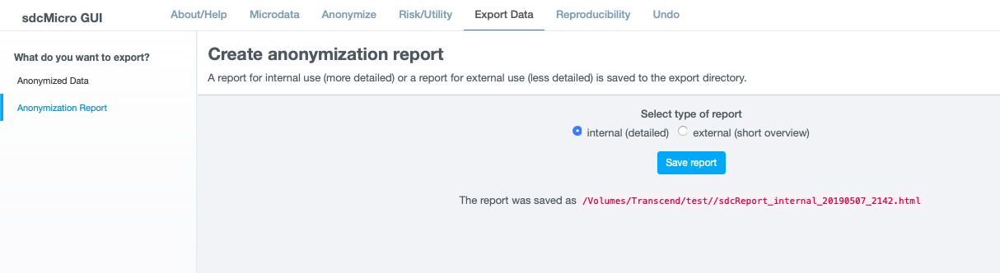

Export data and reports
=======================

Export anonymized dataset
-------------------------
*sdcApp* supports datasets in several foreign data formats. The file formats that are 
supported for loading microdata are also supported for export (cf. :numref:`tab101`). 

In order to export the file, click on  **Anonymized Data** in the left sidebar on the
**Export Data** tab. The dataset shown is the file as it will be exported. Select the
appropriate file format with the radiobuttons underneath the data.

In case the microdata is exported as csv or STATA file, additional options need to 
be specified. For a csv file, whether first row should include column names, 
the field separator as well as the decimal separator. For STATA files, the version of STATA
needs to be specified. STATA cannot STATA files saved for a higher version.

Option to randomize the order of the records. Order may reveal values, e.g. 
ordered by region with suppressed region value Need to replace existing ID

In order to export the dataset, click on blue button **Save dataset**. The dataset is saved
to the 

By clicking on the blue button Save script to file at the top of the page, the script is 
saved as R script (extension .R) on disk to the selected storage path on the 
About/Help tab (see Introduction to sdcApp). The filename of the exported script 
starts with ‘exportedScript_sdcMicro’ followed by a date and time stamp, e.g., 
‘exportedScript_sdcMicro_20181010_1212.R’.
, exported two with file name... Exported to 

the microdata, select

.. _tab101:

.. table:: Data formats compatible with sdcApp
   :widths: auto
   :align: center
   
   ==========  ================
   Software     File extension
   ==========  ================
   R/RStudio	.rdata
   SPSS			.sav
   SAS			.sas7bdat
   CSV			.csv, .txt
   STATA		.dta
   ==========  ================

Also for intermediate export 

..NOTE::	
	Categorical variables (type factor in *sdcApp*) that were had a value and a 
	label in the input dataset are
	
	labels (variable, value), coding 0,1 to 1,2 etc.

Extra for STATA input files: change variable labels for STATA files

Exporting reports
-----------------
It is extremely important to document the SDC process of microdata both for internal 
use as well as for external use. The internal report should contain detailed descriptions
of all steps carried out as well as reasoning for 

Generic drafts of both an 

Internal report
~~~~~~~~~~~~~~~
An important step in the SDC process is reporting, both internal and external. 
Internal reporting contains the exact description of anonymization methods used, 
parameters but also the risk measures before and after anonymization. This allows 
replication of the anonymized dataset and is important for supervisory authorities/bodies
to ensure the anonymization process is sufficient to guarantee anonymity according 
to the applicable legislation.

Report is just technical overview, not complete

file path, name of file

.. _fig103:

   
   Exporting an internal report

External report
~~~~~~~~~~~~~~~
The external report informs the user that the data has been anonymized, 
provides information for valid analysis on the data and explains the limitations to 
the data as a result of the anonymization. A brief description of the methods used 
can be included. The release of anonymized microdata should be accompanied by the 
usual metadata of the survey (survey weight, strata, survey methodology) as well as 
information on the anonymization methods that allow researchers to do valid analysis 
(e.g., amount of noise added, transition matrix for PRAM).

file path, name of file

.. _fig104:

.. figure:: media/exportReportExternal.png
   :align: center
   
   Exporting an external report

