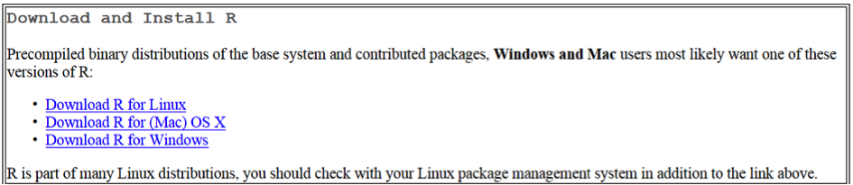

Installation
====================================================================================

R and RStudio
------------------------------------------------------------------------------------
Note: set install dependencies to TRUE

Install R from the `CRAN website <https://cran.r-project.org>`_ .

   
R is a free open source package available Linux, Windows and Mac OS X. 
Please install the latest version of R. If an earlier R version is installed,
please remove this version and reinstall the latest version.
 
Install RStudio from the website: https://www.rstudio.com/products/rstudio/download/ 

RStudio is a Graphical User Interface for R. 

Scroll down and select the file corresponding to your OS: 

The sdcMicro Package
------------------------------------------------------------------------------------
 
Install the latest version of the sdcMicro add-on package (internet connection is required). 

To do so launch R and type the command:

.. code-block:: R

		install.packages("sdcMicro")
		
A prompt will ask you to select a CRAN mirror (server) to install the package from. 
Note: R will automatically install any necessary and missing dependencies. This may take some time. 
Dependencies are other add-on packages, which provide aditional functionality required to run the sdcMicro package.

Once the sdcMicro package is installed you can load it by typing at the R command prompt: library(sdcMicro) 
and launch the application by typing sdcApp():

.. code-block:: R

		library("sdcMicro")
		sdcApp()
		
The application opens in your default web browser through the local host IP: 127.0.0.1

**NOTE:** An internet connection is not required while using sdcMicro and sdcApp and the data 
stored locally on your computer or server. The web browser uses a local host IP, 
which is not connected to the internet and the browser is only used to communicate with 
the running R session.

Additional launch options:

.. code-block:: R

		library("sdcMicro")
		sdcApp(maxRequestSize = 50, debug = FALSE, theme = "IHSN", ..., shiny.server = FALSE)
		
*Arguments*

+ maxRequestSize (numeric) number defining the maximum allowed filesize (in megabytes) for uploaded files, defaults to 50MB
+ debug logical if TRUE, set shiny-debugging options
+ theme select stylesheet for the interface. Supported choices are::

	yeti
	flatly
	journal
	IHSN

+ ... arguments (e.g host) that are passed through runApp when starting the shiny application
+ shiny.server Setting this parameter to TRUE will return the app in the form of an object rather than invoking it. This is useful for deploying sdcApp via shiny-server.
  
