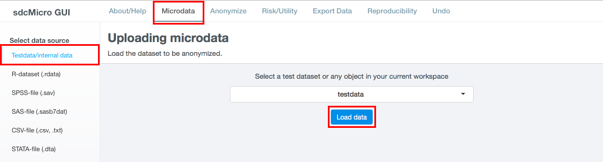
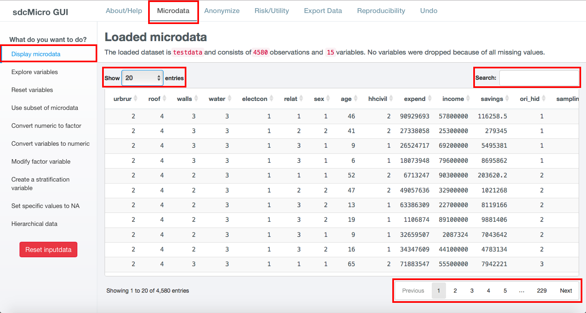
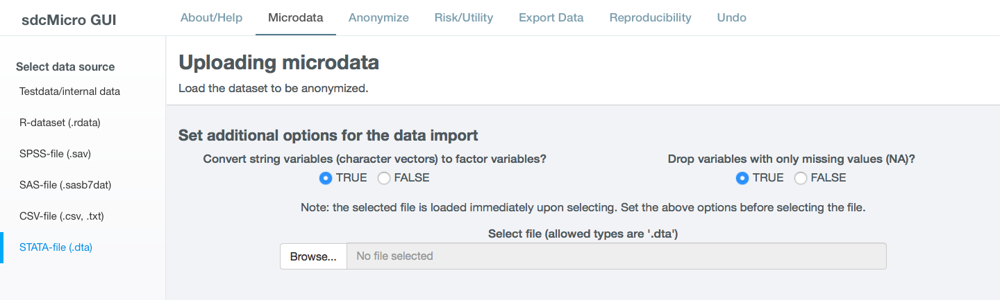
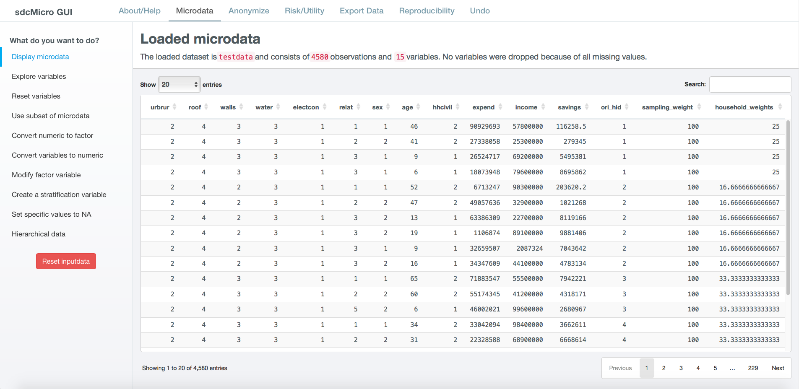
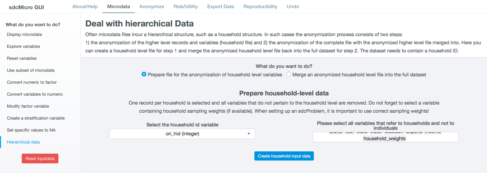

Loading and Preparing Data
==========================

This section shows how to load microdata into *sdcApp* and prepare the data
for the SDC process.

The first step in the SDC process is loading the dataset into *sdcApp*. *sdcApp* supports
most common statistical data formats, such as *R*, *STATA*, *SPSS* and *SAS* files. First-time 
users may also load one of the two practice datasets, which are included in *sdcApp*, 
to explore *sdcApp* and methods. Most examples in this guide are illustrated by 
using the practice dataset *testdata* and can be reproduced by using this dataset.

After loading the data, the user needs to prepare the data for the SDC process.
Most preparation steps can be carried out in *sdcApp*, although users may find it 
more convenient to perform some of these actions in another statistical software 
before loading the data in *sdcApp*.

Loading data
------------

Testdata
~~~~~~~~
*sdcApp* includes two practice datasets: *testdata* and *testdata2*. The dataset
*testdata* is used to illustrate methods and examples in this guide. In order to
replicate these examples, the user needs to load this dataset. In order to load the testdata
dataset, navigate to the **Microdata tab** and select **Testdata/Internal data** in the left sidebar.
Select the dataset from the dropdown menu and click the button **Load data**. 
This is illustrated in :numref:`fig51`. 

.. NOTE::
	Any other datasets loaded in the current *R* session are also shown in the dropdown list 
	with available datasets and can be loaded.

After loading the dataset, the data is displayed in the **Microdata** tab. The **Microdata**
tab changes and the functionality for loading microdata is replaced by 
functionality to explore and prepare the dataset (cf. :numref:`fig52`). The 
left sidebar shows different options to explore and prepare the data for the anonymization process,
as discussed in the next sections.

After loading the testdata dataset, the loaded 
dataset is displayed (cf. :numref:`fig52`). By default the first 20 records are displayed. 
With the dropdown menu in the topleft corner it is possible to display 20, 50, 100 or all
records per page. It is not recommended to select *All* in case of larger datasets as
*sdcApp* will run very slowly. In the right-bottom corner of the screen it is possible to navigate to different pages,
either by clicking *Next* or by clicking on a page number. The table
with the data is both horizontally and vertically scrollable with the scrollbars on the 
right side and bottom of the table. To sort the data by a variable, click on the symbol 
with two arrows (|sort| or |sort2|) next to the variable name in the header of the table.
The data is searchable by using the search bar on the right top of the table. Only records 
with matches are displayed. The search is performed simultaneously on all variables.

.. |sort| image:: media/prepLoadSort.png	

	
.. _fig51:

   
   Load testdata on **Microdata** tab

.. _fig52:

   
   Loaded testdata dataset on **Microdata** tab
	
Your microdata
~~~~~~~~~~~~~~~
*sdcApp* supports besides the native *R* format datasets in several foreign data formats 
(cf. :numref:`tab51`). 
If the microdata is not in one of these data formats, another software can be used 
to convert the data, such as *Stat/Transfer*. Also some statistical software allow to export
data in another data format.

.. _tab51:

.. table:: Data formats compatible with *sdcApp*
   :widths: auto
   :align: center
   
   ==========  ================
   Software     File extension
   ==========  ================
   R/RStudio	.rdata
   SPSS			.sav
   SAS			.sas7bdat
   CSV			.csv, .txt
   STATA		.dta
   ==========  ================
   
In order to load a dataset, select the corresponding data format
from the left sidebar of the **Microdata** tab. For all formats the user can set two options:
	
(1)	Convert string variables (character vectors) to factor variables?
		If :code:`TRUE` (default), variables of type string are automatically converted to categorical variables 
		(type factor in *R*). Categorical variables need to be of type factor in *sdcApp*.
		Remove any textual variables, such as 'Specify other:' variables before loading the
		data. These variables are oftentimes not suitable for release and require long
		computation times to be transformed to factor. If :code:`FALSE`,
(2)	Drop variables with only missing values (NA)?
		If :code:`TRUE` (default), variables that contain only missing values (:code:`NA` in *R*) 
		are removed upon loading the data. This does not cause any loss of information,
		as these variabels do not contain information. However, variables with only
		missing values can cause issues in *sdcApp*. If :code:`FALSE`, no variables are deleted.

If the selected data format is a CSV-file, two additional options need to be specified:

(1)	Does the first row contain the variable names?
		If :code:`TRUE`, the values in the first row are used as variable names. If 
		:code:`FALSE`, the variables names are set to V1, V2, V3, ... in the order of 
		appearance in the dataset.
(2)	Field separator
		The field separator in the csv file needs to be specified. Options are comma (,), 
		semicolon (;) and tab.

After setting the options for the data upload, click on the button **Browse** to access
the file system in your computer and select the microdata file. The file is upload 
immediately after selection. After loading the file, which may 

.. NOTE::	
	Set the additional options before selecting the datafile from your file system.
	Upon selection after clicking **Browse**, the file is immediately loaded and settings 
	can no longer be changed. If the file was accidentally loaded before setting all 
	parameters, the file needs to be reloaded after first restting the microdata by 
	clicking **Reset microdata** in the left sidebar.

.. NOTE::
	The default maximum file size in *sdcApp* is 50 MB. In order to upload larger files,
	the maximum file size in MB needs to be specified upon launching *sdcApp*. This can
	be achieved by specifying the argument :code:`maxRequestSize`:
	
	.. code-block:: R
   		:linenos:
   		:caption: Launching *sdcApp* to load larger files
   	
   		# Launch sdcApp with increased max. file size (200MB)
   		sdcApp(maxRequestSize = 200)

.. _fig53:

   
   Load data on Microdata tab - example STATA dataset 

After loading the testdata dataset, the loaded 
dataset is displayed (cf. :numref:`fig52`). By default the first 20 records are displayed. 
With the dropdown menu in the topleft corner it is possible to display 20, 50, 100 or all
records per page. It is not recommended to select *all* in case of larger datasets
*sdcApp* will run very slow. In the right bottom it is possible to navigate to different pages,
either by clicking *Next* or by clicking on a page number. The table
with the data is both horizontally and vertically scrollable with the scrollbars on the 
right side and bottom of the table. To sort the data by a variable, click on the symbol 
with two arrows next to the variable name in the header of the table.

After loading the dataset, the data is shown in the **Microdata** tab. The **Microdata**
tab changes and the functionality for loading microdata is replaced with 
functionality to explore and prepare the dataset (cf. :numref:`fig511`). The 
left sidebar shows different options to explore and prepare the data for the anonymization process,
as discussed in the next sections.

.. _fig511:

   
   Microdata tab after loading dataset 
   
   
maxrequestsize option for loading larger files

Inspect and explore data
------------------------
After loading the dataset into *sdcApp*, the data is shown on the Microdata tab. At the top of 
the data viewer, the number of observations and variables is shown as well as the number 
of variables that were deleted as a result all missing values (cf. :numref:`fig511`). 

.. NOTE::
	If *Drop variables with only missing values (NA)?* is set to TRUE, the number of variables
	shown may be lower than the number of variables in the loaded dataset.

It is important to check whether the data was imported completely and correctly by browsing
the dataset in *sdcApp*. If, for example, records are missing or labels are corrupted, 
then these issues need to be fixed outside of *sdcApp* and the data need to be reimported.

By clicking **Explore variables** in the left sidebar, univariate and bivariate summary
statistics appropriate for the variable type can displayed. If one variable is selected,
univariate summary statistics are shown. 

.. NOTE::
	The choice of summary statistics is based on the variable type specified in *R* (shown in
	brackets after the variable name, e.g., urbrur (integer)). Therefore, 
	the representation may not be correct, if the variable type does not correspond
	with the variable content. By converting the variable (see `Convert variable type`_),
	the correct summary statistics will be displayed.
	

Preparing data
--------------
Most datasets need to be prepared before the start of the anonymization process. Examples 
of data preparation are removing variables that are not suitable for release, etc. It is
recommended to carry out the data preparation in a statistical software of choice, before 
loading the data in sdcApp. Data preparation includes 

After loading the data in sdcApp, still some steps may need to be carried, which are 
specific to the needs of the sdcApp. These steps are discussed in the following subsections.

Convert variable type
~~~~~~~~~~~~~~~~~~~~~~
numeric to factor

to numeric

Set specific values to NA
~~~~~~~~~~~~~~~~~~~~~~~~~
Missing values play an important role in anonymization of microdata. In particular when 
measuring disclosure risk of categorical key variables (see `Risk`__). sdcApp only considers
the R missing value :code:`NA` as missing. Therefore, it is important to recode other missing values,
such as 9, 99, 998 or 999, "Missing", "Not applicable" after loading the
data to the R missing value :code:`NA`, if appropriate. Many standard missing value codes 
in the data, such as :code:`.` in STATA are automatically converted to NA upon loading
the data into *sdcApp*.

.. _fig57:

.. figure:: media/prepareMissingToNA.png
   :align: center
   
   Screen to set specific value in a variable to NA

Modify factor variable
~~~~~~~~~~~~~~~~~~~~~~
Recoding (see Recoding)

.. NOTE::
	(this note may come in other places as well) *sdcApp* is an aid for completing the
	microdata anonymization process. However, sometimes it may be easier and quicker to 
	use other statistical software packages for performing data preparation steps, such as 
	recoding.
	
Create stratification variable
~~~~~~~~~~~~~~~~~~~~~~~~~~~~~~

.. _fig58:

.. figure:: media/prepStrataVariable.png
   :align: center
   
   Screen to create new stratification variable

Reset variables
~~~~~~~~~~~~~~~

Hierarchical data
~~~~~~~~~~~~~~~~~

.. _fig59:

   
   Screen to create household level dataset
   
   
.. _fig510:

.. figure:: media/prepHierarchical2.png
   :align: center
   
   Screen merge anonymized household level dataset with individual level dataset
   
Use subset of microdata
~~~~~~~~~~~~~~~~~~~~~~~

