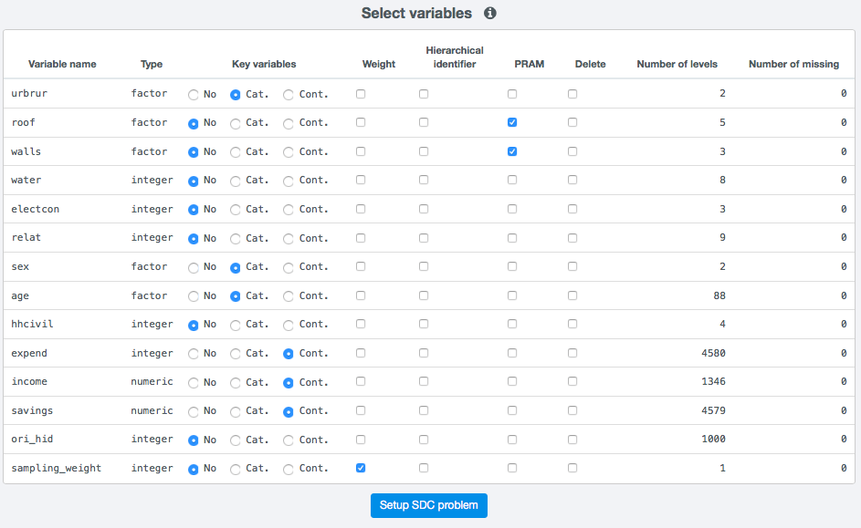
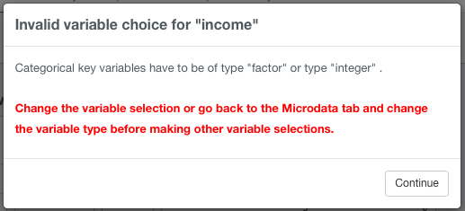

Setup anonymization problem
============================

Based on the analysis of the disclosure scenarios (see ), the user needs can make the variable 
selection in *sdcApp* and set some other parameters in order to define the 
so-called SDC problem. Once the data is loaded and prepared,
the tab *Microdata* shows a variable selection matrix in the main panel. The right sidebar
shows several parameter settings and allows to have a quck summary view of each of the variables
in the loaded dataset.

Variable selection
------------------
In order to setup an SDC problem the user needs to make a variable selection. The variable
selection itself is the result of the analysis of diclosure scenarios and is beyond the scope
of this manual. We refer to Chapter in for a thorough discussion of disclosure scenarios.

The matrix shown in :numref:`fig11` contain one row for each variable in the loaded dataset
and nine different columns as described in :numref:`tabsetup1`. The user can select for each
variable the function it has in the sDC problem. No selection needs to 
be made for variables that are not relevant to the 
anonymization process and can be released without further treatment. Each of the different 
columns is described in more detail:

1.  **Variable name**
	This column specifies the variable name as provided in the original dataset. 
	Variable names cannot be changed in *sdcApp*, as they are unique identifiers. If
	the anonymization process renders a variable name no longer appropriate, the variable 
	must be renamed after exporting the dataset in a software of choice.
2.  **Type**
	Each variable has a internal *R* type. The different types include
	numeric, integer, factor and string. Each of the different functions in the 
	SDC process requires a specific variable type, e.g., the weight needs to be numeric.
	If a variable is not of the appropriate type, the type of the variable needs to be changed
	before a selection is made (see the Section `Convert variable type <loadprepdata.html>`__).
3.  **Key variables**
	Variables that are determined as key variables in the disclosure
	scenario need to be selected here. By default the radiobutton is at *No*. A variable
	can either be a categorical key variable (*cat.*) or a numeric key variable (*cont.*). 
	The sets of categorical key variables and numeric key variables are treated independently
	in *sdcApp*. Categorical key variables can be of type integer or factor. Numeric key variables
	can be of type integer or numeric. At least one variable needs to be selected as 
	categorcial key variable in order to create an SDC problem.
4.  **Weight**
	The sampling weight is used to measure the disclosure risk. The weight
	variable needs to be of type numeric.
5.  **Hierarchical identifier**
	If the data has a hierarchical structure, e.g., individuals
	in households, the variable that defines this hierarchy needs to be selected as 
	hierarchical identifier (see also the Section `Risk`). This could be for instance a household ID. The hierarchical
	identifier needs to be a unique ID in the complete dataset and the same for each 
	member of the hierarchical unit (household). If the unique hierachical indentifier is 
	composed of several variabels, e.g., a geographical identifier, such as region, and
	a household ID which is unique within regions but not across, a unique hierarchical 
	identifier needs to generated before importing the data into *sdcApp*. This can be done in
	a software of choice by concatenating the different components. 
	The household identifier can be of type ...
6.  **PRAM**
	If some variables are considered for application of the PRAM method (see `PRAM <anon.html#PRAM>`__), 
	they need to be specified at this stage. PRAM variables can be of type.
7.  **Delete**
	Variables that need to be deleted from the dataset for release, such as 
	direct identifiers, need to be selected here. Variables to be deleted can be of any type.
8.  **Number of levels**
	This column shows the number of unique values in each variable. For instance a gender
	variable has typically two different levels. Note that if a variable contains missing 
	values, this is also considered as a distinct value.
9.  **Number of missing** 
	This column indicates the number of missing values in each variable.
	If values were set to NA, the missing value code in R, these are counted here. Other
	missing value codes, such as 9, 99, 998 need to be set to NA
	(see also the Section `Set missing values to NA <loadprepdata.html>`__).
	
.. NOTE:: 
	All variables need to be of the appropriate variable type. If the variable type of a 
	variable is not suitable for the selected variable function, a popup window with an error 
	message will appear. If necessary, the variable type needs to be changed before setting up the SDC
	problem.
	
.. _fig11:

   
   Table on Anonymize tab for variable selection

.. _tabsetup1:

.. table:: Columns in setup table
   :widths: auto
   :align: center
   
   =========================  =======================================================================================================================
	Column header              Description
   =========================  =======================================================================================================================
   Variable name			   Name of variable in original dataset
   Type                        Variable type in R (factor, integer, numeric, character)
   Key variables               Radio buttons to select variable as cat. or cont. key variable
   Weight                      Column to select variable as weight variable
   Hierarchical identifier     Column to select variable as hierarchical identifier
   PRAM                        Column to select variable for PRAM method
   Delete                      Column to select variable to be deleted from released dataset
   Number of levels            Number of different values (including NA/missing) in a categorical (type factor) variable
   Number of missing           Number of records with missing value for this particular variable
   =========================  =======================================================================================================================

Once a valid variable selection is made, a blue button will appear at the bottom of the 
setup table:

.. _fig12:

.. figure:: media/setupButton.png
   :align: center
   
   Blue setup button appears below the setup table if the variable selection is valid

If a variable selection is invalid, the setup button will disappear and only reappears once
all invalid choices are corrected. Popup windows as shown in :numref:`fig13`,
will guide the user through the variables
that need to be fixed. The most common invalid choices are the selection of more
than one function for a variable and the selection of a function that does not correspond
with the variable type.

Before clicking the blue button to setup the SDC problem, several parameters have to be set, 
as outlined in the next section.

.. NOTE:: 
	If an invalid variable choice is made, such as an invalid variable type 
	or a variable is selected for more than one choice, a pop-up window with an informative
	error message is shown. An example is shown in :numref:`fig13`. The error
	message can be closed by clicking *Continue*.
	It is important to undo the invalid selection after clicking away 
	the error message, as this doesn't happen automatically. 
	Not correcting the selection will
	make it later difficult to trace back the invalid selections. 
	The blue setup button disappears and reappears once the problem is fixed.

.. _fig13:

   
   Example of a popup window with an error message after an invalid variable choice

Settings
--------
Besides the variable selection, there are two more parameters to be set before creating
the SDC problem: alpha and seed. Both parameters can be set with sliders
in the right sidepanel (see :numref:`fig14`).

.. _fig14:

.. figure:: media/setupAdditionalParameters.png
   :align: center
   
   Sliders to set additional parameters for the SDC problem

Alpha
~~~~~
The parameter alpha is used to compute the frequencies of keys, which is used to compute risk
measures for categorical key variables. Alpha is the weight with which a key that coincides 
based on a missing value (NA) contributes to these frequencies. The default value of the
parameter alpha is 1, which means that two records that have the same key (combination
of values in key variables), are considered to coincide completely.

Seed
~~~~
Every time a probabilistic method is used, a different outcome is generated. For these 
methods it is often recommended that a seed be set for the random number generator
if you want to produce replicable results. The seed is used to initialize the 
random number generator used for probabilistic methods. In *sdcApp*, the seed can
be set to any integer value from 0 to 500. To select a value, you can click with
the mouse pointer on the slider and use the arrow keys (left and right or up and down) 
to select an exact value. In :numref:`fig14` the seed is set at 388.

.. NOTE:: 
	In order to replicate exact results when using probabilistic methods, the order in
	which the methods are carried out influences the results. Therefore, besides the seed,
	also the order of the operations needs to be the same. The seed changes when used in 
	the random number generator. When the undo button is used (see ), the seed is not
	reset to the value prior to the reverted step.

Summary view
------------
After setting up the SDC problem, the application jumps automatically to the summary
view of the *Anonymize* tab. When an SDC problem is available, the *Anonymize* tab 
provides a summary of the SDC problem and allows to apply anonymization methods.

This tab first shows a Summary overview of the problem. The content of the summary page varies with
the SDC problem. For example, if no numerical key variables were selected, the information on
numeric key variables is omitted. Fig shows the summary page.

